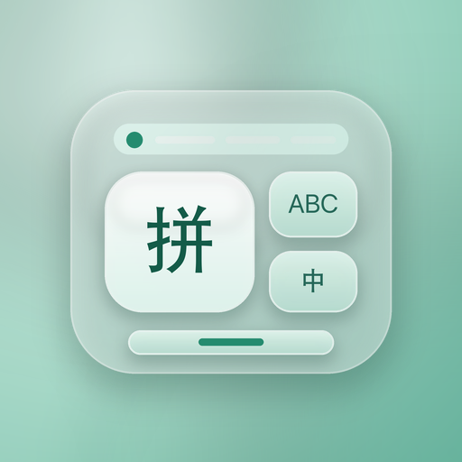
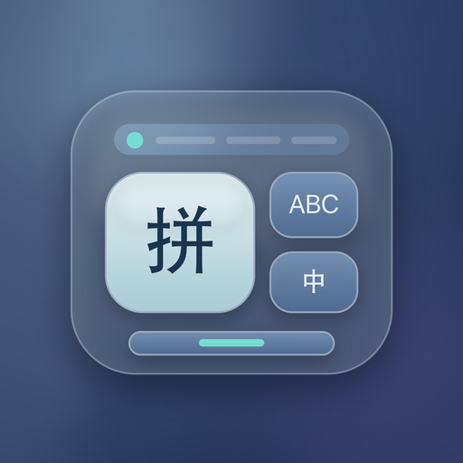
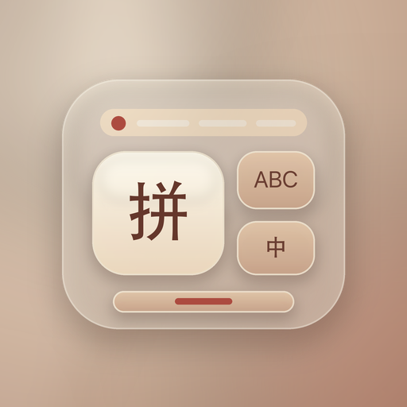
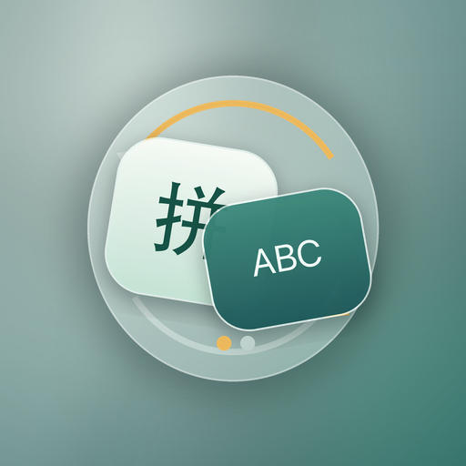
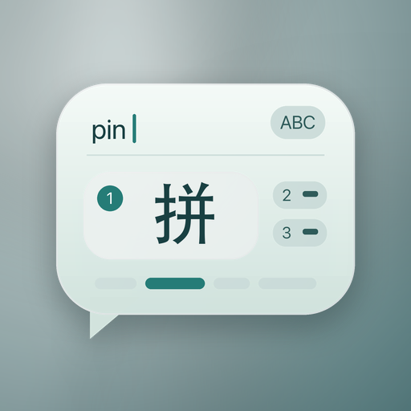
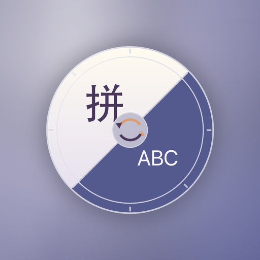
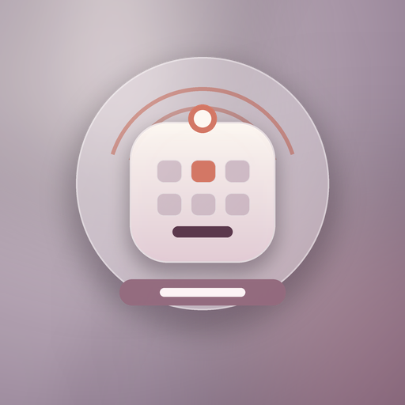
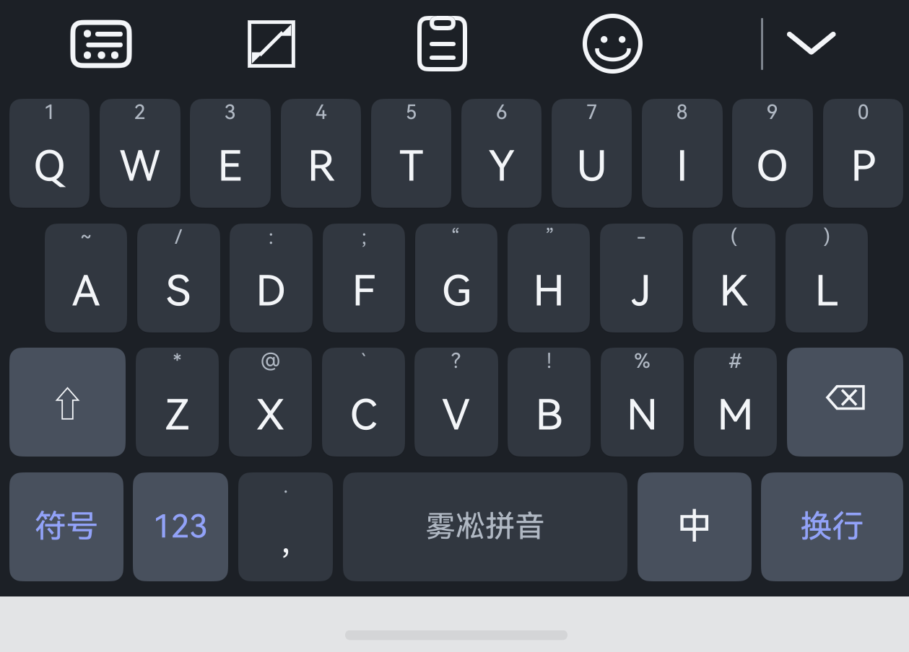
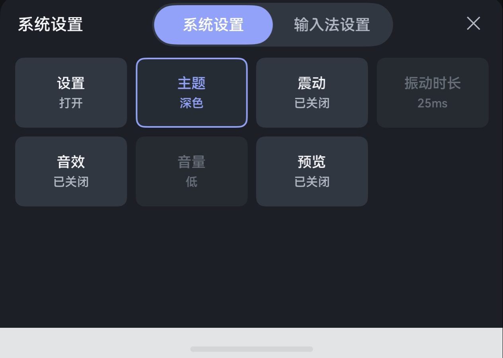

# 薄荷输入法

薄荷输入法是一款面向 HarmonyOS 的 Rime 中文输入法，提供拼音候选、中英文切换、方案切换、主题设置、剪贴板等常用能力。

## 环境要求

- HarmonyOS SDK 6.1.0（API 23）
- HarmonyOS 6.1+

## 桌面图标方案

| - | - | - |
| --- | --- | --- |
|  薄荷玻璃 |  暮蓝沉浸 |  暖砂键盘 |
|  翡翠切换 |  墨青候选 |  雾紫语言轮 |
|  雾海语球 |  流光光标 |  触键涟漪 |

默认使用“薄荷玻璃”

## 键盘截屏

| 面板 | 面板 |
| --- | --- |
|  主面板 |  设置面板 |

## 支持功能
- [x] 剪贴板
- [ ] 复制自动填充
- [x] emoji
- [x] 高度调节
- [x] 主题
- [ ] 输入法沙箱数据共享
- [ ] 自定义上传rime词库
- [ ] 键盘面板沉浸式
